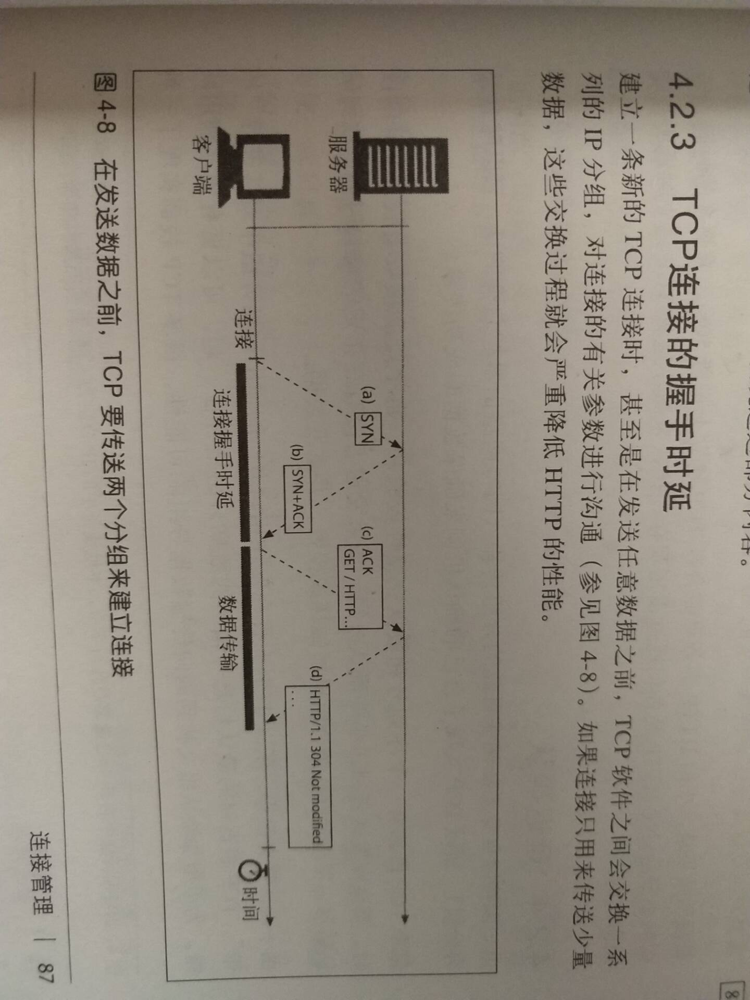

## 连接管理

####  HTTP分层
	1. HTTP 应用层
	2. TCP 传输层
	3. IP  网络层
	4. 网路接口  数据链路层

#### HTTPS分层
	1. HTTP 应用层
	2. TSL or SSL  安全层
	3. TCP 传输层
	4. IP  网络层
	5. 网络接口  数据链路层

#### IP分组
	1.一个IP 分组首部（通常为20个字节）
	2.一个TCP段首部（通常为20字节）
	3.一个TCP数据块（0个或多个字节）

#### TCP连接通过4个值来识别
	1. 源IP地址
	2. 源端口号
	3. 目的IP地址
	4. 目的端口号

#### 造成TCP网络时延的大小取决于？
	1. 硬件速度、网络
	2. 服务器的负载、请求和响应报文
	3. 客户端与服务器之间的距离

#### 性能聚焦区域
    1.TCP连接建立握手
    2.TCP慢启动拥塞控制
    3.数据聚集的Nagle算法；
    4.用于捎带确认的TCP 延迟确认算法
    5.TIME_WAIT时延和端口耗尽。

#### TCP握手

##### 描述
	1. 请求新的TCP 连接时，客户端要向服务器发送一个小的TCP分组（通常是40~60个字节）。这个分组中设置了一个特殊的SYN标记，说明这是一个连接请求。
	2. 如果服务器接收了连接，就会对一些连接参数进行计算，并向客户端会送一个TCP分组，这个分组中的SYN和ACK标记都被置位，说明连接请求已被接收
	3. 最后，客户端向服务器回送一条确认消息，通知它连接已成功建立，现在的TCP栈都允许客户端在这个确认分组中发送数据。

#### 四个事务
	1.并行连接
		1.通过多条TCP连接发起并发的HTTP请求
	
	2.持久连接
		1.重用TCP连接，以消除连接及关闭时延
	
	3.管道化连接
	
		1.通过共享的TCP连接发送并发的HTTP请求
	4.复用的连接
		1.交替传送请求和相应报文。	

